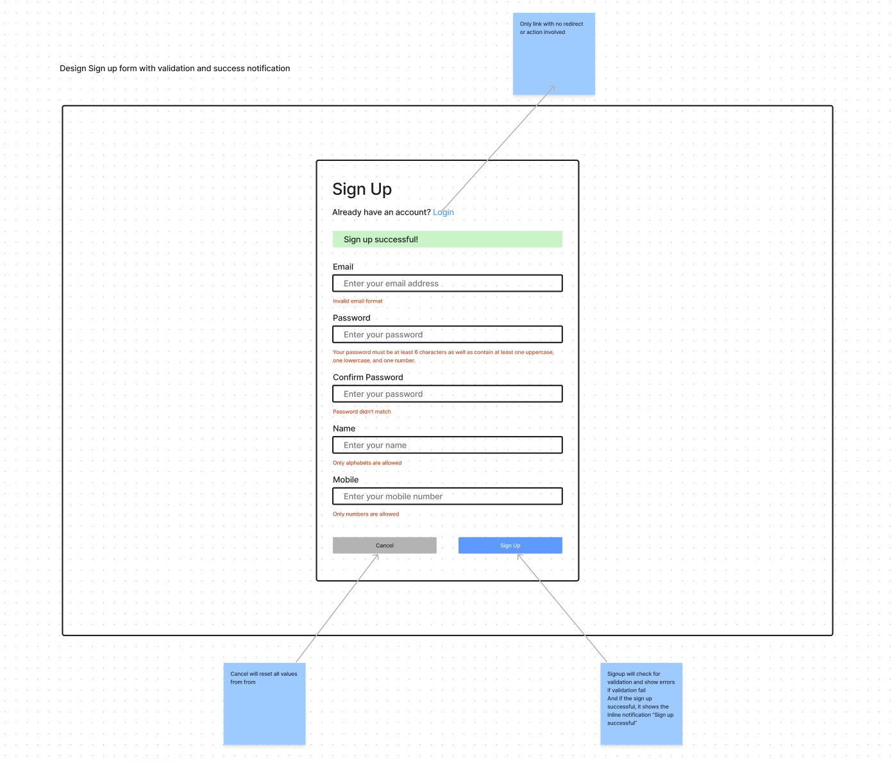

# frontend-interview-project

## Objectives:

* Develop a sign-in page in react and showcase it on a storybook environment

## Tasks:

1. Clone this repository to begin
2. Set up storybook platform. Follow the instructions [here](https://gist.github.com/shilman/bc9cbedb2a7efb5ec6710337cbd20c0c) as reference.
3. Develop a sign-in page using react and carbon components (refer to the carbon repository [here](https://github.com/carbon-design-system/carbon/tree/main/packages/react)) and host in in the storybook platform that was set up in step 1. 

4. Ensure that the button colour for "Cancel" is using the colour #B3B3B3.
5. Implement the validation logic and show the errors clearly as defined in the outline in point 2 (You are encouraged to add any other validation rules that you think is useful for this use case.)
6. Commit all your codes into the repository
7. Create a pull request back to this main repository
8. Send a link to the pull request via email as submission

## Notes: 
Use carbon components as much as possible. You don't have to look exactly like the overview but the general components should be there.
